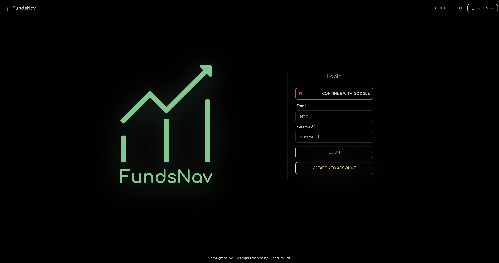
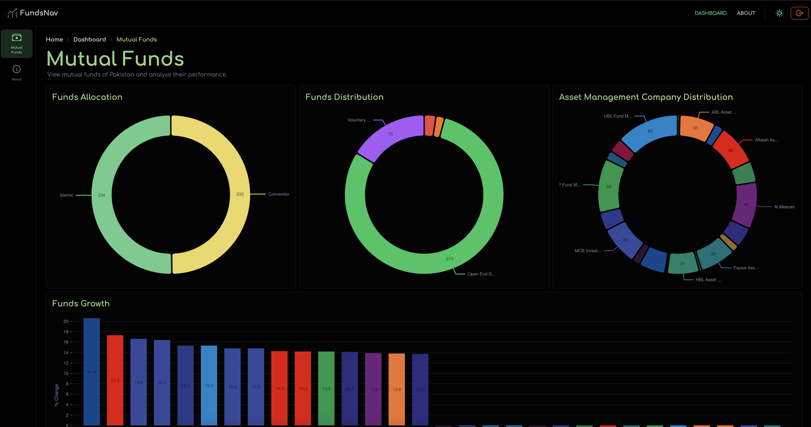
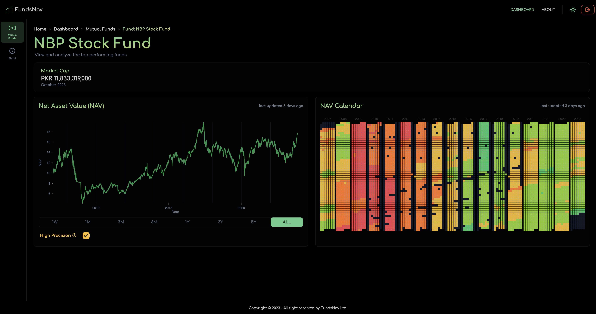

# FundsNav

<!-- add image -->

FundsNav (https://fundsnav.com) - High Performance Mutual Funds Analysis Platform with over 200+ listed funds of all the asset management companies present in Pakistan.

Provides a detailed analysis of funds with the following features:

- Fund Performance
- Fund Comparison
- Fund Ranking

### Full Stack application made using:

Backend: Django Rest (Python)
 
Frontend: Next.js (React.js, Tailwind CSS)
 
DB: PostgreSQL

With daily updates of funds data through python scripts written on AWS Lambda (scraps and inserts into db from https://www.mufap.com.pk/) and cached on a low latency Redis instance.

##### Deployed on AWS ECS (Elastic Container Service) using AWS Copilot (https://aws.github.io/copilot-cli/)
